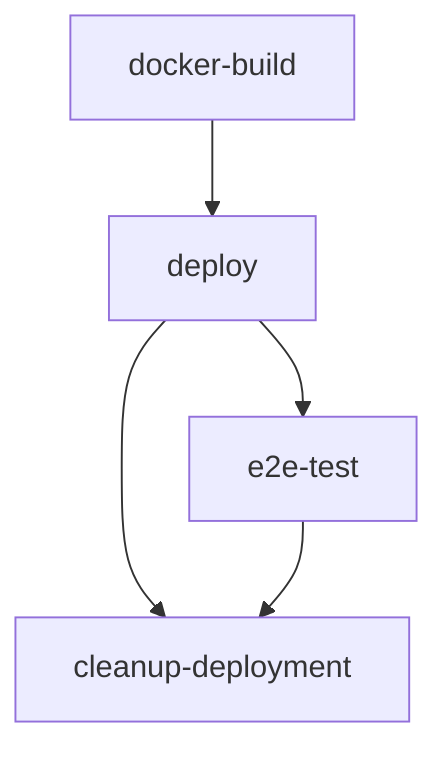

# Deploy-Test-Cleanup (Parameterized) GitHub Workflow Guide

## Overview

The **Deploy-Test-Cleanup (Parameterized)** workflow is a comprehensive GitHub Actions pipeline designed to automate the deployment, testing, and cleanup of a document generation solution accelerator on Azure. This workflow provides flexible deployment options with support for different environments, configurations, and testing scenarios.

## Table of Contents

1. [Workflow Triggers](#workflow-triggers)
2. [Configuration Parameters](#configuration-parameters)
3. [Environment Variables](#environment-variables)
4. [Job Architecture](#job-architecture)
5. [Job Flows and Dependencies](#job-flows-and-dependencies)
6. [Detailed Job Descriptions](#detailed-job-descriptions)
7. [Usage Scenarios](#usage-scenarios)
8. [Prerequisites](#prerequisites)
9. [Monitoring and Notifications](#monitoring-and-notifications)
10. [Troubleshooting](#troubleshooting)

## Workflow Triggers

The workflow can be triggered in four different ways:

### 1. Pull Request Trigger
```yaml
pull_request:
  branches:
    - main
```
- **When**: When a pull request is opened/updated against the main branch
- **Purpose**: Test PR changes in a deployed environment
- **Configuration**: Automatically uses Non-WAF + Non-EXP configuration
- **Behavior**: Deploys → Tests → Cleans up

### 2. Workflow Run Trigger
```yaml
workflow_run:
  workflows: ["Build Docker and Optional Push"]
  types: [completed]
  branches: [main, dev, demo]
```
- **When**: After the "Build Docker and Optional Push" workflow completes
- **Purpose**: Deploy newly built Docker images
- **Configuration**: Automatically uses Non-WAF + Non-EXP configuration
- **Behavior**: Uses existing Docker images → Deploys → Tests → Cleans up

### 3. Manual Dispatch (Most Flexible)
```yaml
workflow_dispatch:
```
- **When**: Manually triggered via GitHub Actions UI
- **Purpose**: Custom deployments with full parameter control
- **Configuration**: User-specified via input parameters
- **Behavior**: Configurable based on input parameters

### 4. Scheduled Trigger
```yaml
schedule:
  - cron: '0 9,21 * * *'  # 9:00 AM and 9:00 PM GMT
```
- **When**: Automated runs twice daily
- **Purpose**: Regular validation and monitoring
- **Configuration**: Automatically uses Non-WAF + Non-EXP configuration
- **Behavior**: Deploys → Tests → Cleans up

## Configuration Parameters

### Manual Dispatch Input Parameters

| Parameter | Type | Default | Description |
|-----------|------|---------|-------------|
| `run_e2e_tests` | Boolean | `true` | Execute end-to-end tests after deployment |
| `cleanup_resources` | Boolean | `false` | Delete deployed resources after testing |
| `waf_enabled` | Boolean | `false` | Enable Web Application Firewall configuration |
| `EXP` | Boolean | `false` | Enable experimental features |
| `AZURE_ENV_LOG_ANALYTICS_WORKSPACE_ID` | String | `''` | Existing Log Analytics Workspace ID |
| `AZURE_EXISTING_AI_PROJECT_RESOURCE_ID` | String | `''` | Existing AI Project Resource ID |
| `existing_webapp_url` | String | `''` | Test against existing deployment instead of creating new |
| `build_docker_image` | Boolean | `false` | Build and push new Docker image |

### Automatic Configuration Logic

For automatic triggers (PR, workflow_run, schedule):
- **WAF**: Always `false`
- **EXP**: Always `false`
- **Cleanup**: Always `true`
- **E2E Tests**: Always `true`
- **Docker Build**: Always `false`

For manual triggers:
- Uses input parameter values or defaults
- EXP auto-enables if EXP parameters are provided but EXP is `false`

## Environment Variables

### Global Environment Variables
```yaml
GPT_MIN_CAPACITY: 150              # Minimum GPT capacity for quota check
TEXT_EMBEDDING_MIN_CAPACITY: 80    # Minimum embedding capacity
BRANCH_NAME: ${{ github.event.workflow_run.head_branch || github.head_ref || github.ref_name }}
```

### Dynamic Environment Variables
```yaml
WAF_ENABLED: # Determined based on trigger type and inputs
EXP: # Determined based on trigger type and inputs  
CLEANUP_RESOURCES: # Determined based on trigger type and inputs
RUN_E2E_TESTS: # Determined based on trigger type and inputs
BUILD_DOCKER_IMAGE: # Determined based on trigger type and inputs
```

## Job Architecture

The workflow consists of 4 main jobs that execute conditionally based on configuration:



### Job Execution Matrix

| Job | Pull Request | Workflow Run | Manual (Fresh) | Manual (Existing URL) | Schedule |
|-----|-------------|-------------|---------------|---------------------|----------|
| **docker-build** | ❌ Skip | ❌ Skip | ✅/❌ Conditional | ❌ Skip | ❌ Skip |
| **deploy** | ✅ Run | ✅ Run | ✅ Run | ❌ Skip | ✅ Run |
| **e2e-test** | ✅ Run | ✅ Run | ✅/❌ Conditional | ✅/❌ Conditional | ✅ Run |
| **cleanup-deployment** | ✅ Run | ✅ Run | ✅/❌ Conditional | ❌ Skip | ✅ Run |

## Job Flows and Dependencies

### 1. Docker Build Job (`docker-build`)

**Execution Condition:**
```yaml
if: github.event_name == 'workflow_dispatch' && github.event.inputs.build_docker_image == 'true'
```

**Purpose:**
- Builds custom Docker images for manual deployments
- Creates unique image tags for tracking
- Only runs when explicitly requested via manual trigger

**Outputs:**
- `IMAGE_TAG`: Unique Docker image tag for deployment

**Steps:**
1. Generate unique Docker tag (`branch-timestamp-runid`)
2. Set up Docker Buildx
3. Login to Azure Container Registry
4. Build and push Docker image with multiple tags
5. Verify successful build

### 2. Deploy Job (`deploy`)

**Execution Condition:**
```yaml
if: always() && (github.event_name != 'workflow_dispatch' || github.event.inputs.existing_webapp_url == '' || github.event.inputs.existing_webapp_url == null)
```

**Purpose:**
- Deploys the document generation solution to Azure
- Configures infrastructure based on WAF and EXP settings
- Processes sample data post-deployment

**Key Features:**
- **Quota Validation**: Checks Azure quota before deployment
- **Dynamic Configuration**: Adapts to WAF/Non-WAF and EXP/Non-EXP settings
- **Resource Management**: Creates unique resource groups and solution prefixes
- **Docker Image Selection**: Uses appropriate image based on build status and branch
- **Post-deployment Processing**: Runs sample data processing scripts

**Outputs:**
- `RESOURCE_GROUP_NAME`: Created resource group name
- `WEBAPP_URL`: Deployed web application URL
- `ENV_NAME`: Azure Developer CLI environment name
- `AZURE_LOCATION`: Deployment region
- `IMAGE_TAG`: Docker image tag used

**Critical Steps:**
1. **Quota Check**: Validates sufficient Azure quotas
2. **Configuration Validation**: Auto-enables EXP if parameters provided
3. **Resource Generation**: Creates unique names for resources
4. **Docker Image Determination**: Selects appropriate image tag
5. **Azure Deployment**: Uses `azd up` for infrastructure deployment
6. **Post-processing**: Processes sample data and configurations
7. **Notification**: Sends success/failure notifications

### 3. E2E Test Job (`e2e-test`)

**Execution Condition:**
```yaml
if: always() && ((needs.deploy.result == 'success' && needs.deploy.outputs.WEBAPP_URL != '') || (github.event.inputs.existing_webapp_url != '' && github.event.inputs.existing_webapp_url != null)) && (github.event_name != 'workflow_dispatch' || github.event.inputs.run_e2e_tests == 'true' || github.event.inputs.run_e2e_tests == null)
```

**Purpose:**
- Executes comprehensive end-to-end tests
- Tests against deployed or existing web application
- Validates application functionality

**Test Target Priority:**
1. `existing_webapp_url` (if provided)
2. `needs.deploy.outputs.WEBAPP_URL` (from deployment)

**Implementation:**
- Calls external workflow: `./.github/workflows/test-automation.yml`
- Passes target URL and inherits all secrets

### 4. Cleanup Deployment Job (`cleanup-deployment`)

**Execution Condition:**
```yaml
if: always() && needs.deploy.result == 'success' && needs.deploy.outputs.RESOURCE_GROUP_NAME != '' && github.event.inputs.existing_webapp_url == '' && (github.event_name != 'workflow_dispatch' || github.event.inputs.cleanup_resources == 'true' || github.event.inputs.cleanup_resources == null)
```

**Purpose:**
- Removes deployed Azure resources to prevent cost accumulation
- Cleans up custom Docker images from ACR
- Maintains standard branch images (latest_waf, dev, demo)

**Cleanup Actions:**
1. **Docker Image Cleanup**: Deletes custom-built images (preserves standard tags)
2. **Infrastructure Cleanup**: Uses `azd down --purge --force` to remove all resources
3. **Environment Cleanup**: Removes Azure Developer CLI environments

**Resource Preservation:**
- Preserves standard Docker images (`latest_waf`, `dev`, `demo`)
- Only deletes custom-generated images with unique timestamps

## Usage Scenarios

### Scenario 1: Testing Pull Request Changes
```yaml
# Automatic trigger on PR
Trigger: Pull Request → main
Configuration: Non-WAF + Non-EXP (forced)
Flow: Deploy → Test → Cleanup
Result: Validates PR changes in real environment
```

### Scenario 2: Production-like Deployment with WAF
```yaml
# Manual trigger via GitHub Actions UI
Trigger: workflow_dispatch
Parameters:
  - waf_enabled: true
  - cleanup_resources: false
  - run_e2e_tests: true
Flow: Deploy (WAF) → Test → Keep Resources
Result: Production-ready deployment with security features
```

### Scenario 3: Testing Against Existing Deployment
```yaml
# Manual trigger for existing environment testing
Trigger: workflow_dispatch
Parameters:
  - existing_webapp_url: "https://existing-app.azurewebsites.net"
  - run_e2e_tests: true
Flow: Skip Deploy → Test Existing → No Cleanup
Result: Validates existing deployment without creating new resources
```

### Scenario 4: Custom Docker Image Deployment
```yaml
# Manual trigger with custom image
Trigger: workflow_dispatch
Parameters:
  - build_docker_image: true
  - cleanup_resources: false
Flow: Build Docker → Deploy → Test → Keep Resources
Result: Deploys with freshly built Docker image
```

### Scenario 5: EXP Feature Testing
```yaml
# Manual trigger with experimental features
Trigger: workflow_dispatch
Parameters:
  - EXP: true
  - AZURE_ENV_LOG_ANALYTICS_WORKSPACE_ID: "workspace-id"
  - AZURE_EXISTING_AI_PROJECT_RESOURCE_ID: "project-id"
Flow: Deploy (EXP) → Test → Cleanup
Result: Tests experimental features with existing Azure resources
```

## Prerequisites

### Required Secrets

| Secret Name | Purpose | Example |
|-------------|---------|---------|
| `AZURE_CLIENT_ID` | Service Principal Application ID | `12345678-1234-1234-1234-123456789012` |
| `AZURE_CLIENT_SECRET` | Service Principal Password | `secretvalue` |
| `AZURE_TENANT_ID` | Azure AD Tenant ID | `87654321-4321-4321-4321-210987654321` |
| `AZURE_SUBSCRIPTION_ID` | Azure Subscription ID | `abcdefgh-ijkl-mnop-qrst-uvwxyz123456` |
| `ACR_TEST_LOGIN_SERVER` | Container Registry Server | `myregistry.azurecr.io` |
| `ACR_TEST_USERNAME` | Container Registry Username | `myregistry` |
| `ACR_TEST_PASSWORD` | Container Registry Password | `registrypassword` |
| `LOGIC_APP_URL` | Logic App endpoint for notifications | `https://logic-app-url.com/webhook` |
| `EXP_LOG_ANALYTICS_WORKSPACE_ID` | Default Log Analytics Workspace | `workspace-resource-id` |
| `EXP_AI_PROJECT_RESOURCE_ID` | Default AI Project Resource | `project-resource-id` |

### Required Variables

| Variable Name | Purpose | Example |
|---------------|---------|---------|
| `AZURE_REGIONS` | Comma-separated list of Azure regions | `eastus,westus2,westeurope` |

### Azure Permissions

The service principal requires the following Azure permissions:

- **Subscription Level**:
  - `Contributor` role for resource creation/deletion
  - `User Access Administrator` for role assignments

- **Azure Container Registry**:
  - `AcrPush` role for Docker image operations
  - `AcrPull` role for image retrieval

## Monitoring and Notifications

### Email Notifications

The workflow sends email notifications via Logic App webhook for:

1. **Quota Check Failure**
   - Triggered when insufficient Azure quotas detected
   - Includes build URL for investigation

2. **Deployment Success**
   - Includes resource group name and web app URL
   - Provides access links for immediate testing

3. **Deployment Failure**
   - Includes failure details and build URL
   - Enables quick troubleshooting response

### Notification Format
```json
{
  "body": "HTML formatted email body with deployment details",
  "subject": "DocGen Deployment - Success/Failure"
}
```

### Log Analysis

**Key Log Locations:**
- **Quota Check**: `scripts/checkquota.sh` output
- **Deployment**: `azd up` command output  
- **Testing**: External test workflow logs
- **Cleanup**: `azd down` command output

**Important Log Markers:**
- `✅` - Success indicators
- `❌` - Failure indicators  
- `⚠️` - Warning messages
- `🔧` - Configuration changes
- `🗑️` - Cleanup operations

## Troubleshooting

### Common Issues and Solutions

#### 1. Quota Check Failures
```bash
Error: No region with sufficient quota found
```
**Solutions:**
- Request quota increase in Azure portal
- Add more regions to `AZURE_REGIONS` variable
- Reduce `GPT_MIN_CAPACITY` and `TEXT_EMBEDDING_MIN_CAPACITY` if possible

#### 2. Docker Build Failures
```bash
Error: Failed to push Docker image
```
**Solutions:**
- Verify ACR credentials are correct
- Check ACR permissions for service principal
- Ensure ACR has sufficient storage quota

#### 3. Deployment Failures
```bash
Error: azd up failed
```
**Solutions:**
- Check Azure service principal permissions
- Verify subscription has sufficient credits
- Review resource naming conflicts
- Check region availability for required services

#### 4. EXP Auto-enablement Issues
```bash
Warning: EXP parameter values provided but EXP is disabled
```
**Solutions:**
- Explicitly set `EXP: true` when providing EXP parameters
- Verify EXP resource IDs are valid and accessible
- Check service principal permissions for EXP resources

#### 5. Cleanup Failures
```bash
Error: Failed to delete resource group
```
**Solutions:**
- Check for resource locks on the resource group
- Verify service principal has `Contributor` access
- Manually delete resources if automated cleanup fails
- Check for dependencies preventing deletion

### Debug Mode Activation

To enable detailed debugging:

1. **Enable Debug Logging**:
   ```bash
   # Add to workflow environment
   ACTIONS_STEP_DEBUG: true
   ```

2. **Manual Resource Inspection**:
   ```bash
   # Use Azure CLI to inspect resources
   az group list --query "[?contains(name, 'arg-docgen')]"
   ```

3. **Docker Image Verification**:
   ```bash
   # Check ACR repository contents
   az acr repository list --name myregistry
   ```

### Recovery Procedures

#### Failed Deployment Recovery
1. Check workflow logs for specific failure points
2. Manually clean up partial resources if needed:
   ```bash
   az group delete --name <resource-group-name> --yes --no-wait
   ```
3. Re-run workflow with same parameters
4. Consider using existing resource options to avoid re-creation

#### Stuck Resource Cleanup
1. Identify locked or dependent resources
2. Manual cleanup using Azure portal or CLI
3. Check for active deployments or dependencies
4. Use `--force` flags for stubborn resources

---

## Best Practices

### 1. Resource Management
- Always use cleanup for testing environments
- Preserve resources only for long-term testing or demo purposes
- Monitor Azure costs regularly

### 2. Parameter Configuration  
- Use WAF for production-like deployments
- Enable EXP only when testing experimental features
- Provide existing URLs to test without new deployments

### 3. Monitoring
- Set up Logic App notifications for team awareness
- Monitor quota usage across regions
- Track deployment success/failure rates

### 4. Security
- Rotate service principal credentials regularly
- Use least-privilege permissions for service principals
- Monitor ACR access logs for unauthorized usage

---

This workflow provides a comprehensive, flexible deployment pipeline that adapts to various testing and deployment scenarios while maintaining security, cost efficiency, and operational reliability.